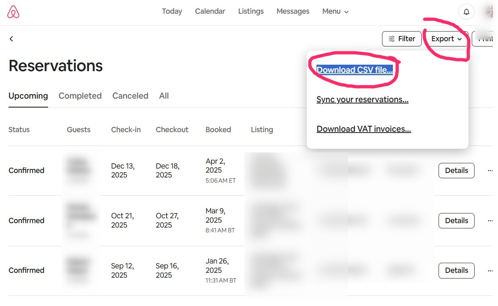

# 🧼 Limpiezas Streamlit App

Upload your Airbnb reservation CSV and get WhatsApp-friendly cleaning messages — supports **Spanish and English listings** automatically.

---

## 📋 How to Use

1. Go to 👉 [Airbnb Reservations](https://www.airbnb.com/hosting/reservations)

2. Click **Export > Download CSV file**
3. Upload the file to the app
4. Copy the generated message and share it via WhatsApp!

3. Copy your cleaning message

## File format

Your CSV should include columns:
- `start date`
- `end date`
- `listing`


## ✅ Example Output

```text
🏠 *Brand New Penthouse*
🌟 **Upcoming Cleaning Schedule** 🌟
- Saturday 19 de April after **11:00 AM** (same-day start date) 🔴
